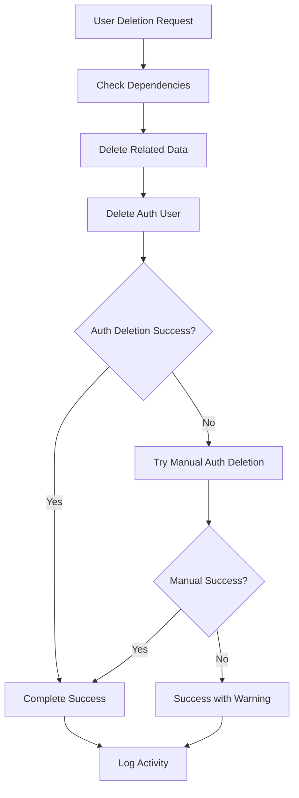

# 🗑️ Complete User Deletion System

## 🎯 **Problem Solved**

Previously, when you deleted a user, only basic data was removed and you had to manually delete the user from Supabase Auth. Now, the system provides **COMPLETE USER DELETION** that removes ALL related data automatically.

## ✅ **What's Included in Complete Deletion**

### **Database Tables Cleaned Up:**
1. **`appointment_change_logs`** - Patient appointment modification history
2. **`lab_results`** - Lab test results and reports
3. **`xray_images`** - X-ray images and metadata
4. **`payment_transactions`** - Payment transaction records
5. **`payment_bookings`** - Appointment payment bookings
6. **`appointments`** - All appointments (as patient AND as doctor)
7. **`doctor_availability`** - Doctor availability schedules (if user is doctor)
8. **`doctors`** - Doctor profile (if user is doctor)
9. **`deletion_requests`** - User deletion requests
10. **`notifications`** - User notifications
11. **`activity_log`** - User activity logs
12. **`userinfo`** - Main user profile data
13. **`auth.users`** - Supabase Auth user (automatic + manual fallback)

## 🚀 **How to Use**

### **Step 1: Run the SQL Script**
Execute `complete_user_deletion_system.sql` in your Supabase SQL Editor to create the new functions.

### **Step 2: Delete Users**
The system now automatically uses the complete deletion when you delete users through:
- Admin Dashboard → Users Management
- Deletion Requests (when approved)

## 🔧 **New Functions Created**

### **1. `check_user_dependencies(user_id_to_delete)`**
- Shows what data will be deleted before deletion
- Returns count of records in each table
- Useful for verification and debugging

**Usage:**
```sql
SELECT check_user_dependencies(123);
```

### **2. `delete_user_completely(user_id_to_delete)`**
- Deletes all related data but keeps auth user
- Returns detailed deletion results
- Safe to use for data cleanup only

**Usage:**
```sql
SELECT delete_user_completely(123);
```

### **3. `delete_auth_user(user_id_to_delete)`**
- Deletes only the Supabase Auth user
- Used as fallback when automatic deletion fails

**Usage:**
```sql
SELECT delete_auth_user(123);
```

### **4. `delete_user_and_auth_completely(user_id_to_delete)`**
- **MAIN FUNCTION** - Complete deletion including auth user
- Deletes all data AND auth user in one operation
- Includes automatic fallback for auth deletion

**Usage:**
```sql
SELECT delete_user_and_auth_completely(123);
```

## 📊 **Deletion Process Flow**



## 🛡️ **Safety Features**

### **1. Dependency Checking**
- Shows exactly what will be deleted before deletion
- Helps prevent accidental data loss
- Useful for auditing

### **2. Atomic Operations**
- All deletions happen in a single transaction
- If any step fails, everything rolls back
- Prevents partial deletions

### **3. Detailed Logging**
- Logs all deletion activities
- Shows exactly what was deleted
- Includes success/failure details

### **4. Fallback Mechanisms**
- Automatic auth user deletion
- Manual auth deletion fallback
- Clear error messages and warnings

## 📝 **Example Usage**

### **Check Before Deletion:**
```sql
-- See what will be deleted
SELECT check_user_dependencies(123);
```

**Result:**
```json
{
  "success": true,
  "userid": 123,
  "user_email": "patient@example.com",
  "user_role": "Patient",
  "dependencies": {
    "appointments_as_patient": 5,
    "payment_bookings": 3,
    "lab_results": 2,
    "xray_images": 1,
    "appointment_change_logs": 4,
    "auth_users": 1
  },
  "total_records": 16
}
```

### **Complete Deletion:**
```sql
-- Delete everything
SELECT delete_user_and_auth_completely(123);
```

**Result:**
```json
{
  "success": true,
  "userid": 123,
  "user_email": "patient@example.com",
  "user_role": "Patient",
  "data_deletion": {
    "success": true,
    "deleted_records": {
      "appointments_as_patient": 5,
      "payment_bookings": 3,
      "lab_results": 2,
      "xray_images": 1,
      "appointment_change_logs": 4,
      "userinfo": 1
    }
  },
  "auth_deletion": {
    "success": true,
    "message": "Auth user deleted successfully"
  },
  "message": "Complete user deletion successful - all data and auth user removed"
}
```

## 🔍 **Frontend Integration**

The frontend has been updated to use the new system:

### **UsersManagement.tsx**
- Uses `delete_user_and_auth_completely()` function
- Shows dependency information before deletion
- Handles auth deletion failures gracefully
- Provides detailed success/error messages

### **deletionRequests.ts**
- Updated `deleteUserAfterApproval()` function
- Includes comprehensive error handling
- Automatic fallback for auth deletion

## ⚠️ **Important Notes**

### **Permissions Required**
- Functions require `SECURITY DEFINER` permissions
- Admin users need execute permissions
- Auth deletion requires admin API access

### **Manual Steps (if needed)**
If automatic auth deletion fails, you may need to:
1. Go to Supabase Dashboard → Authentication → Users
2. Find the user by email
3. Delete the user manually
4. The system will warn you if this is needed

### **Backup Recommendation**
- Always backup important data before mass deletions
- Test the system with a test user first
- Monitor the logs for any issues

## 🎉 **Benefits**

1. **Complete Data Removal** - No orphaned records
2. **Automatic Auth Cleanup** - No manual Supabase Auth deletion needed
3. **Detailed Logging** - Full audit trail of deletions
4. **Safe Operations** - Atomic transactions prevent partial deletions
5. **Fallback Mechanisms** - Handles edge cases gracefully
6. **User-Friendly** - Clear success/error messages
7. **Audit Trail** - Complete activity logging

## 🚨 **Troubleshooting**

### **Common Issues:**

1. **"Permission denied" errors**
   - Ensure functions have proper permissions
   - Check user role and permissions

2. **Auth deletion fails**
   - System will try manual deletion automatically
   - Check Supabase Auth settings and permissions
   - Manual deletion may be required

3. **Foreign key constraint errors**
   - Functions handle this automatically
   - Check if all related tables are included

### **Verification Steps:**
1. Check `check_user_dependencies()` before deletion
2. Monitor console logs during deletion
3. Verify user is completely removed from all tables
4. Check Supabase Auth users list

---

**🎯 Result:** When you delete a user now, ALL their data is automatically removed from the database AND from Supabase Auth. No more manual cleanup needed!
